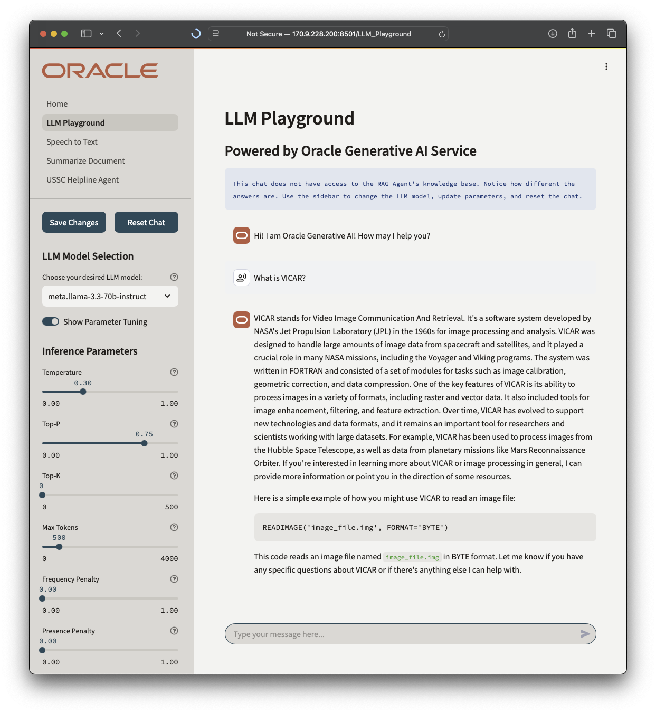
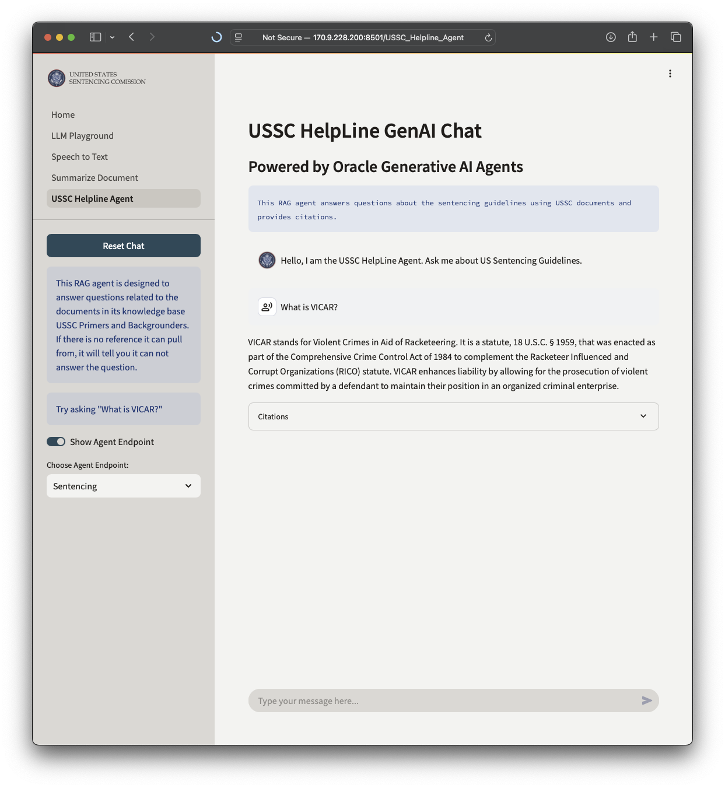
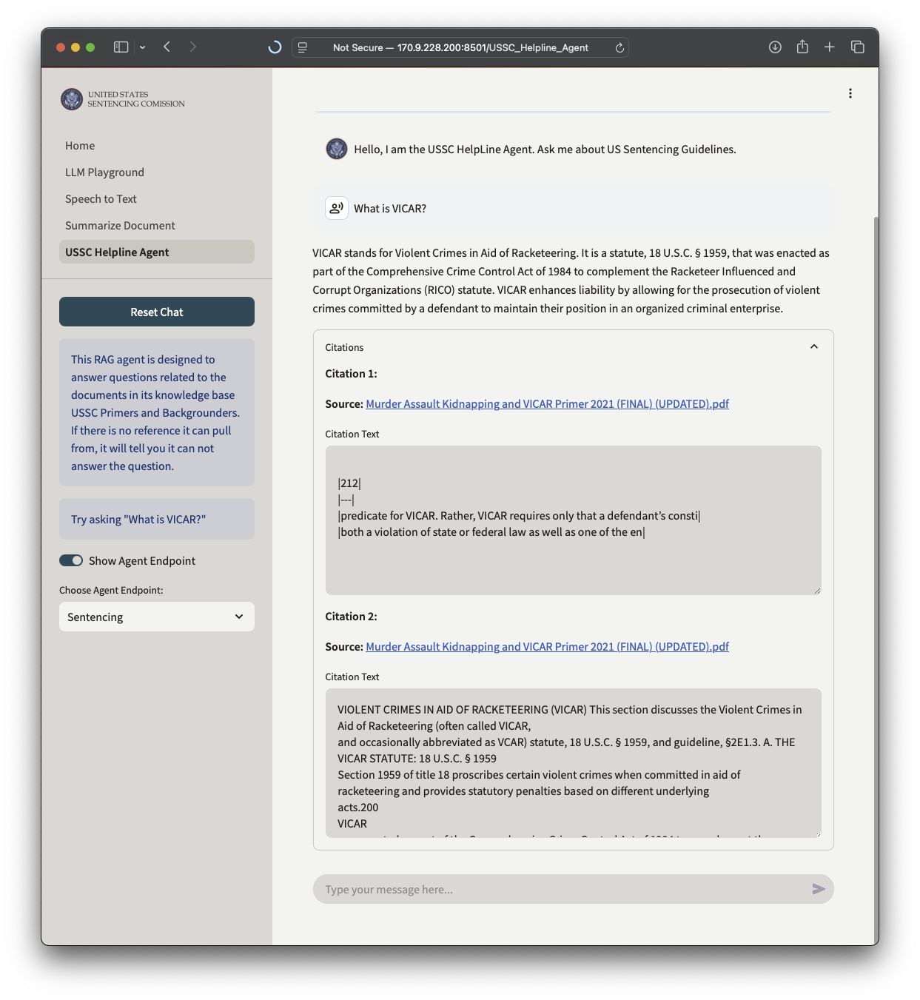
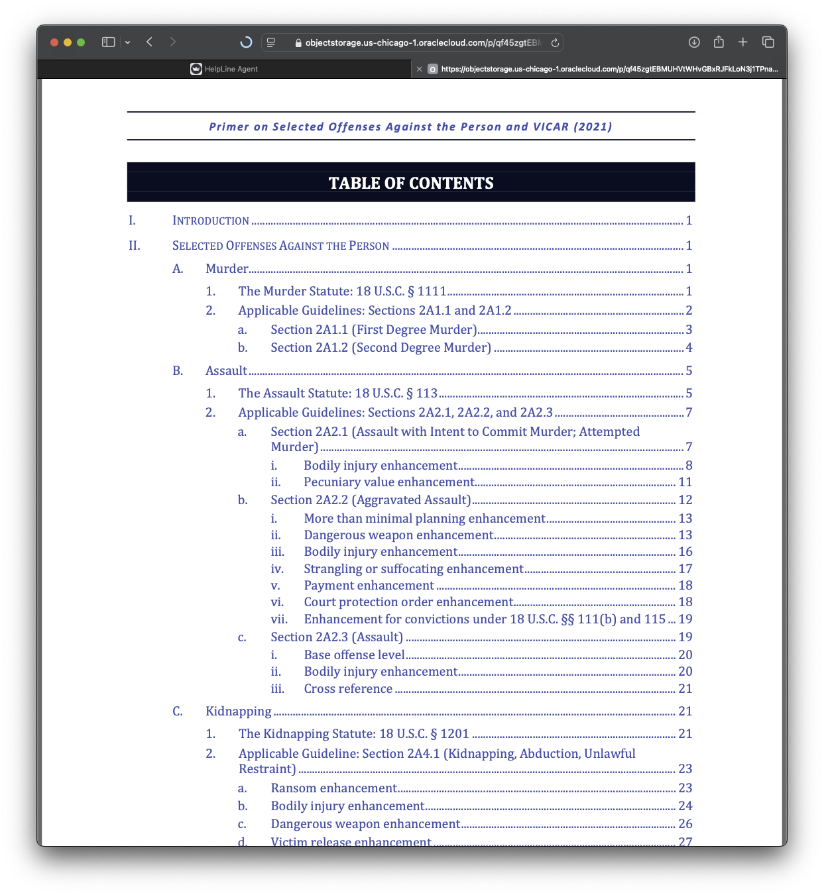
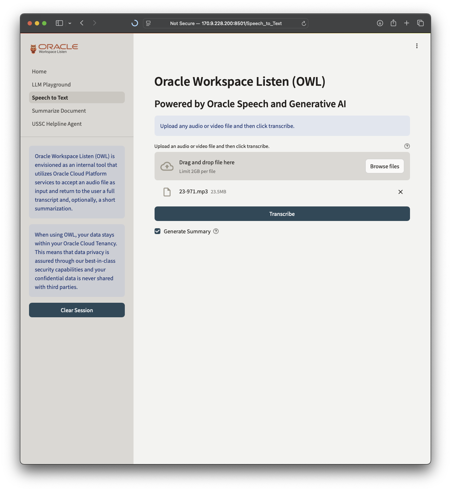
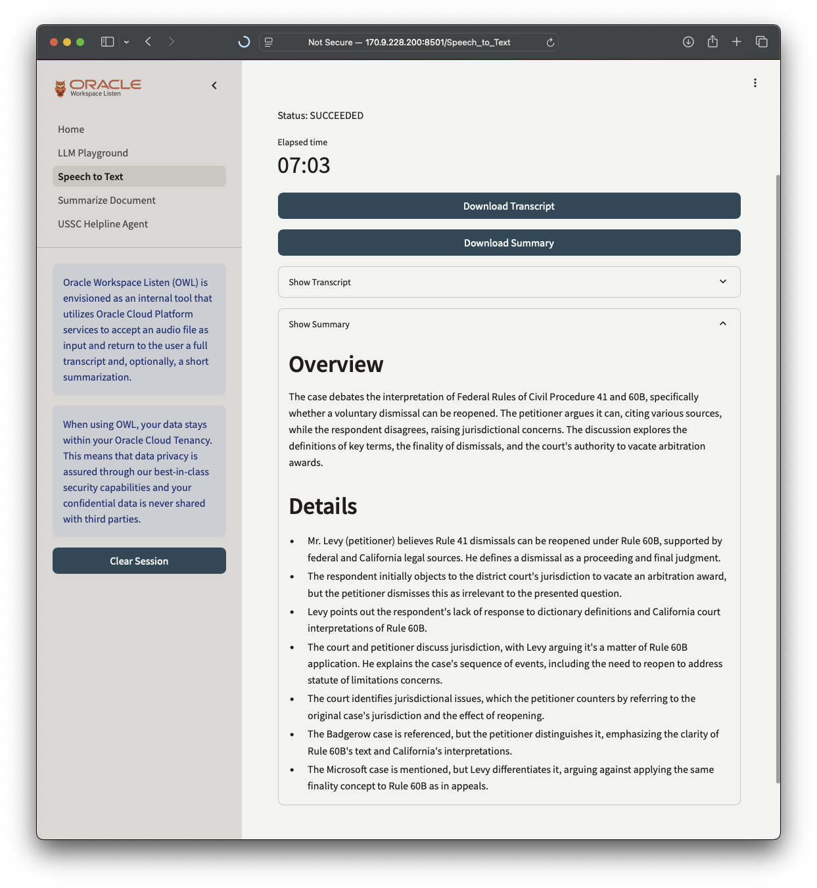
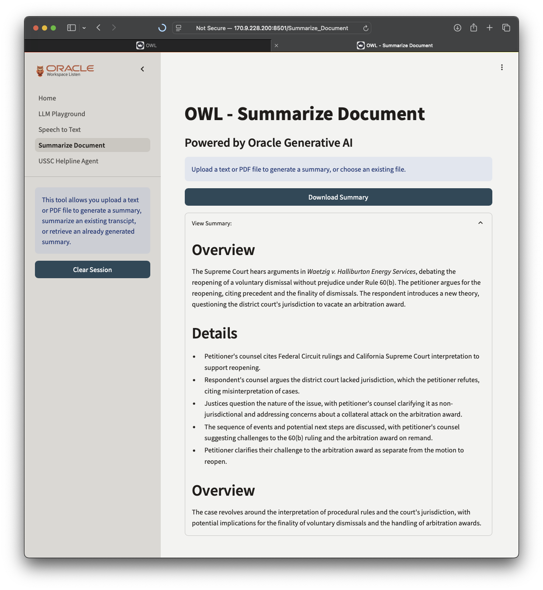

# About

 This 4-in-1 demo showcases the power of **Oracle's Cloud Platform** and **AI Services** with real-world utility:
- The **LLM Playground** shows [**Oracle Cloud Generative AI**](https://docs.oracle.com/en-us/iaas/Content/generative-ai/home.htm) in action. 
- You can play with the hyperparameters and change models with the sidebar.
- **USSC Helpline Agent** uses [**Generative AI Agents**](https://docs.oracle.com/en-us/iaas/Content/generative-ai-agents/home.htm) for a retrieval-augmented generation (RAG) chat.
    - The documents used are all publicly available on [ussc.gov](https://www.ussc.gov/product-type/primers).
    - This was created originally as a tailored demo for the customer. 
- The **Speech to Text** page uses [**OCI Speech**](https://docs.oracle.com/en-us/iaas/Content/speech/home.htm) to transcribe, and [**Generative AI**]((https://docs.oracle.com/en-us/iaas/Content/generative-ai/home.htm)) to provide a summary. 
- The **Summarize Document** page uses [**Generative AI**](https://docs.oracle.com/en-us/iaas/Content/generative-ai/home.htm) to provide a summary of any text or PDF file.
- The UI is Streamlit, an open-source Python framework running on [**OCI Compute**](https://docs.oracle.com/en-us/iaas/Content/Compute/home.htm).

## Live Demo App
[https://genai.pavlakos.cloud](https://genai.pavlakos.cloud/) (currently not so live)

<!-- - Use **RAG Agent** to chat with an AI that has specialized knowledge of Oracle Cloud for US Government. 
  - Ask it things like `How can Oracle Cloud support my agency's zero trust journey?`
- Use **LLM Playground** to chat with foundational models on Oracle Cloud Generative AI Service.
  - You can play with the hyperparamters and change models with the sidebar.
  - Try them out by clicking the links on the sidebar to the left! -->

## Generative AI Agent Features
- **Secure & Private:** All data remains confidential within your Oracle Cloud tenancy, benefiting from all of the built-in security features.
- **Chat with the GenAI Agent:** Have a conversation - ask questions and get insightful answers.
- **View Citations:** Explore the sources behind the agent's responses to validate the responses are grounded. 

## Underlying Architecture

- [**Object Storage**](https://docs.oracle.com/en-us/iaas/Content/Object/home.htm) stores private data files for the RAG knowledge base and speech to text functionality with AES256 encryption.
- [**Generative AI Agents**](https://docs.oracle.com/en-us/iaas/Content/generative-ai-agents/home.htm) provides the RAG pipeline as a PaaS service. 
- [**Open Search**](https://docs.oracle.com/en-us/iaas/Content/search-opensearch/home.htm) is a managed service for the knowledge base, automatically indexed for fast search. 
- [**Generative AI**](https://docs.oracle.com/en-us/iaas/Content/generative-ai/home.htm) Can be either shared or dedicated hosting, with your choice of Cohere and Meta for Large Language Model (LLM).
- [**Compute**](https://docs.oracle.com/en-us/iaas/Content/Compute/home.htm) - a E5 Flex (1 OCPU) virtual machine hosts the Streamlit app to provide the UI. 

## Known Issues
- Live Demo App is down
    - need to rotate SSL certs and update dns

## Try it Out in Your Oracle Cloud Tenancy
### Before you start
- You must have an Oracle Cloud Account subscribed to the Chicago, Frankfurt, or London region
- You must already have an Generative AI Agents endpoint available
  - this app only provides a front end
  - currently only available with whitelisting in Chicago region
- You must set up oci config in order to authenticate to the agent endpoint.
- You must update `.streamlit/secrets.toml`
  - agent_endpoint_id
  - compartment_id
  - other items as noted in comments

### Oracle Cloud Free Tier
- Did you know you can [sign up for an Oracle Cloud Free Tier Account](https://www.oracle.com/cloud/free/)?
   - You get $300 in credits for 30 days to use on all available services
   - You get `Always Free Resources` for as long as you want them including but not limited to: 
      - Oracle Autonmous Database with APEX
      - NoSQL Database
      - 2 AMD Compute Instances with 1/8 OCPU and 1 GB RAM each
      - Up to 4 ARM Compute Instances with a combined total of 4 OCPU and 24 GB of RAM  
      - 200 GB Block Storage
      - 20 GB Object and Archive Storage
      - Security Services including Certificates, Valut and Bastion (managed SSH jumpbox)
      - Observability Services including Logging, Monitoring, Notifications
      - Networking Services including VCN, Load Balancer, Site-to-Site VPN, and 10 TB of outbound data transfer per month
- If you are one of my customers I can get you up to 60 days and $500 in credits. Reach out to me directly and I will get you set up. 

### Get started
0. Set up Generative AI Agents service and note the agent_endpoint_id
2. Make sure you have port 8501 open on security list
3. Launch a VM with Oracle Linux 8 image and attach setup.sh as cloud-init script
4. SSH into your VM (opc@ipaddress) and check the log at /home/opc/genai_agent_setup.log
5. Run setup.sh if you did not add it as cloud-init script
6. Set up [OCI CLI config](https://docs.oracle.com/en-us/iaas/Content/API/SDKDocs/cliinstall.htm)
7. Update `.streamlit/secrets.toml` with your agent_endpoint_id and compartment_id
8. Use run.sh to run the demo
9. Your application will be running on http://server-ip-address:8501
10. Set it up as a service so you can restart it like `sudo systemctl restart streamlit.service`

## Screenshots
### RAG Agent:
 
 
 
### LLM Playground:

### Speech to Text:

### Summarize Document:

