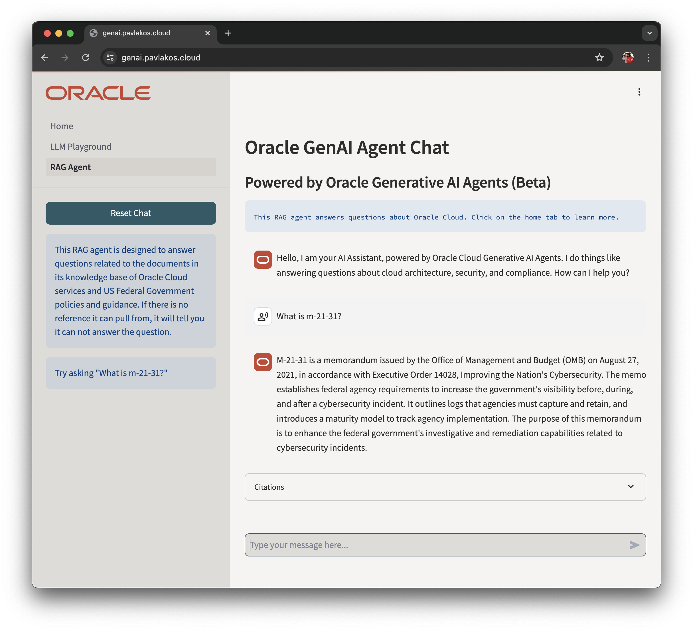
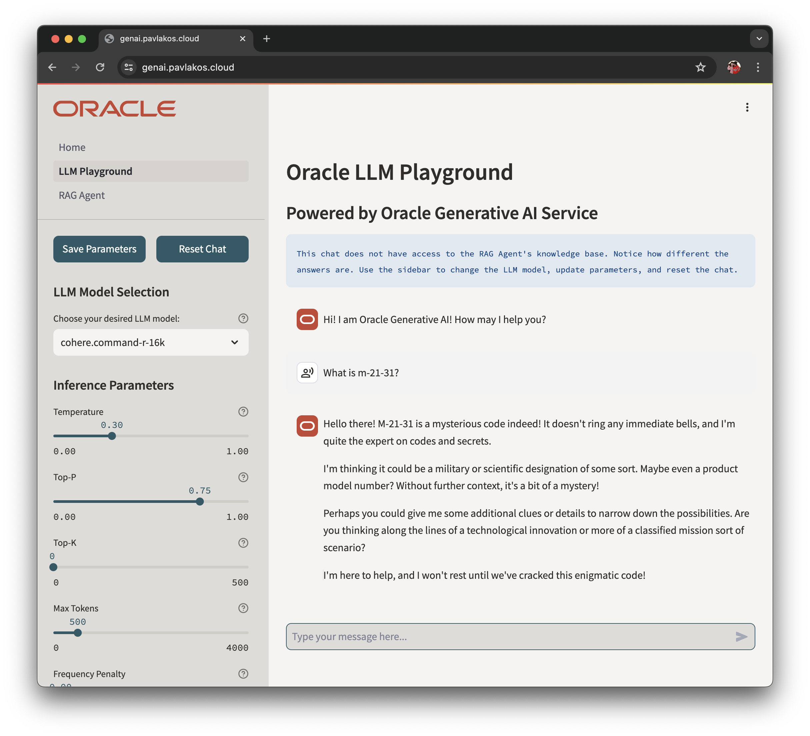

# Oracle Generative AI Agents Sample

Demo Streamlit App for Oracle Cloud Generative AI Agents and LLM Playgroud for Oracle Cloud Generative AI Service 

## Overview of the Demo

- Provides an external UI front end for Oracle Cloud Generative AI Agents, currently in beta.
- Provides an LLM Playground to evaluate differne LLM Models and hyperparameter tuning on Oracle Cloud Generative AI Service

  
## Live Demo App

[https://genai.pavlakos.cloud](https://genai.pavlakos.cloud/)

## Screenshots
 

## Known Issues

- LLM Playground does not display chat history properly.
  - This is to do with how I am handling memory
  - Code will be updated once I fix it

## Try out the demo in your Oracle Cloud Tenancy

### Before you start

- You must already have an Generative AI Agents endpoint available - this app only provides a front end.
- You must set up oci config in order to authenticate to the agent endpoint.
- You must update .streamlit/secrets.toml with your agent_endpoint_id and compartment_id 

### Get started

0. Set up Generative AI Agents service and note the agent_endpoint_id
2. Make sure you have port 8501 open on security list
3. Launch a VM with ubuntu base image and attach setup.sh as cloud-init script
4. SSH into your VM (ubuntu@ipaddress) and check the log at /home/ubuntu/genai_agent_setup.log
5. Run setup.sh if you did not add it as cloud-init script
6. Set up OCI config
7. Update .streamlit/secrets.toml with your agent_endpoint_id and compartment_id
8. Use run.sh to run the demo
9. Your application will be running on http://server-ip-address:8501
